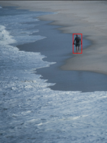

# Zero-Click Image Inpainting Pipeline

[](https://colab.research.google.com/drive/1gscDRmVlumfdt0i-t6_dFGYgE_1c1OCU)

An automated, zero-shot image editing pipeline that dynamically detects objects using GroundingDINO, generates padded segmentation masks via OpenCV, and executes high-fidelity replacement using Stable Diffusion XL Inpainting.

Unlike standard inpainting workflows that require manual brush masking, this pipeline is entirely text-guided and programmatic.

## Architecture

1. **Object Detection:** `IDEA-Research/grounding-dino-base` locates the target object based on a natural language text prompt.
2. **Dynamic Masking:** Bounding boxes are processed with auto-calculated padding and Gaussian blurring to prevent hard edges and visual artifacts during generation.
3. **Inpainting Generation:** `diffusers/stable-diffusion-xl-1.0-inpainting-0.1` reconstructs the masked area using the target prompt, automatically scaling to SDXL-friendly dimensions while preserving scene geometry.

## Results

### Example 1 — Object Removal (3-Stage Pipeline)
**Prompt:** `Empty vast sandy beach, seamless sand texture, gentle ocean waves, serene landscape, photorealistic, 8k resolution`

| Input | Subject Detection | Output |
|---|---|---|
|  |  |  |

---

### Example 2 — Guided Object Insertion (2-Stage Pipeline)
**Prompt:** `A professional businessman in a tailored navy blue suit sitting on a park bench, looking at a newspaper, facing the camera. Photorealistic, 8k, cinematic lighting`

| Input | Output |
|---|---|
|  |  |

## Quick Start

### Installation
```bash
git clone https://github.com/cati3000/zero-click-inpainting-pipeline.git
cd zero-click-inpainting-pipeline
pip install -r requirements.txt
```
